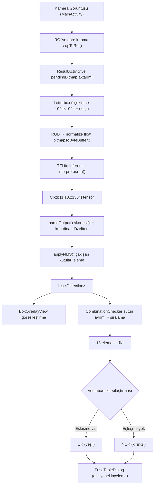

```mermaid
flowchart TD
    A["Kamera Görüntüsü (MainActivity)"] --> B["ROI'ye göre kırpma cropToRoi()"]
    B --> C["ResultActivity'ye pendingBitmap aktarımı"]
    C --> D["Letterbox ölçekleme 1024×1024 + dolgu"]
    D --> E["RGB → normalize float bitmapToByteBuffer()"]
    E --> F["TFLite Inference interpreter.run()"]
    F --> G["Çıktı: [1,10,21504] tensör"]
    G --> H["parseOutput() skor eşiği + koordinat düzeltme"]
    H --> I["applyNMS() çakışan kutuları eleme"]
    I --> J["List&lt;Detection&gt;"]
    J --> K["BoxOverlayView görselleştirme"]
    J --> L["CombinationChecker sütun ayrımı + sıralama"]
    L --> M["18 elemanlı dizi"]
    M --> N{"Veritabanı karşılaştırması"}
    N -->|Eşleşme var| O["OK (yeşil)"]
    N -->|Eşleşme yok| P["NOK (kırmızı)"]
    O --> Q["FuseTableDialog (opsiyonel inceleme)"]
    P --> Q
```
